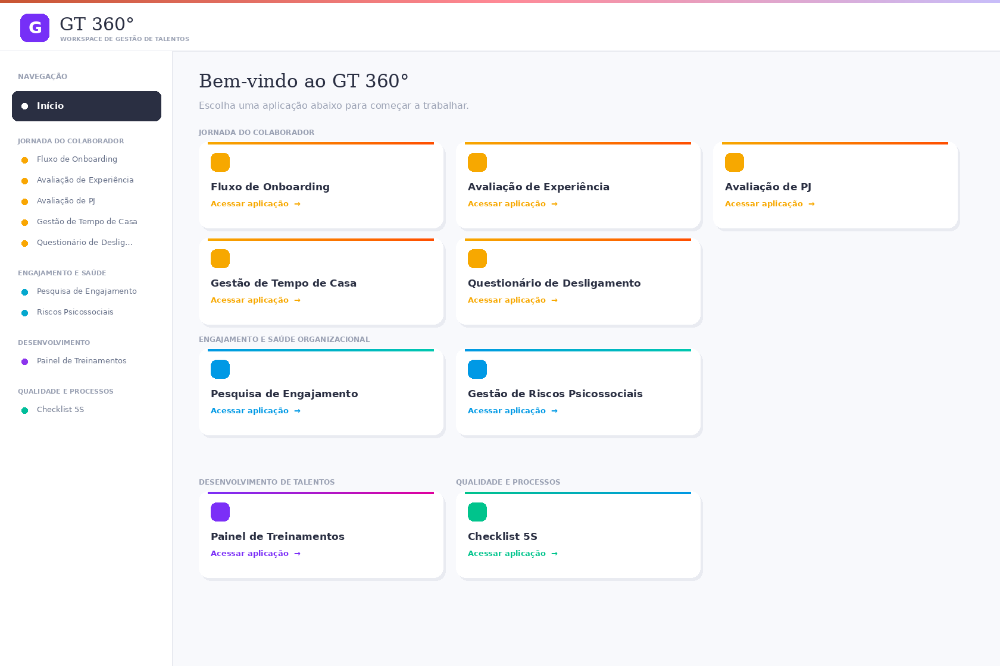
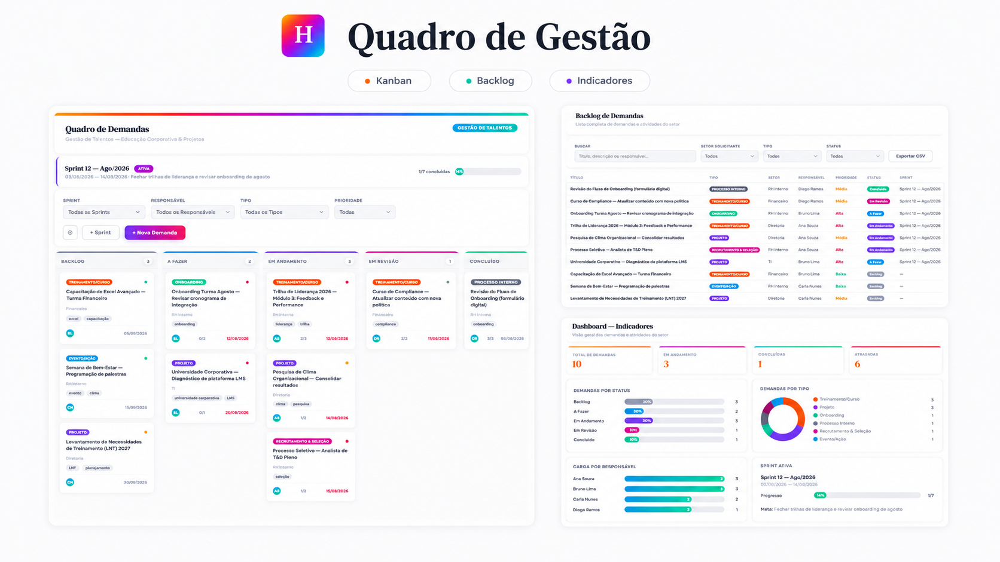
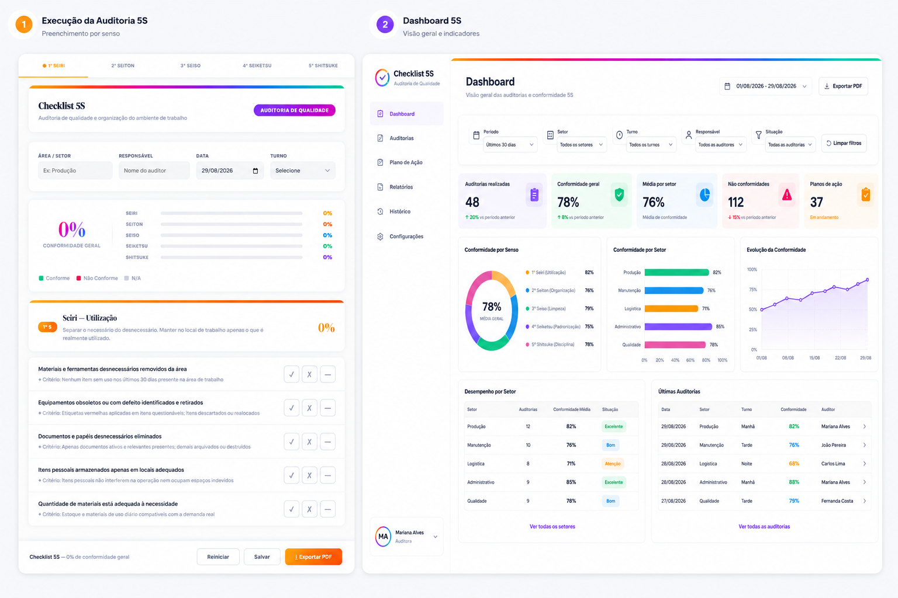
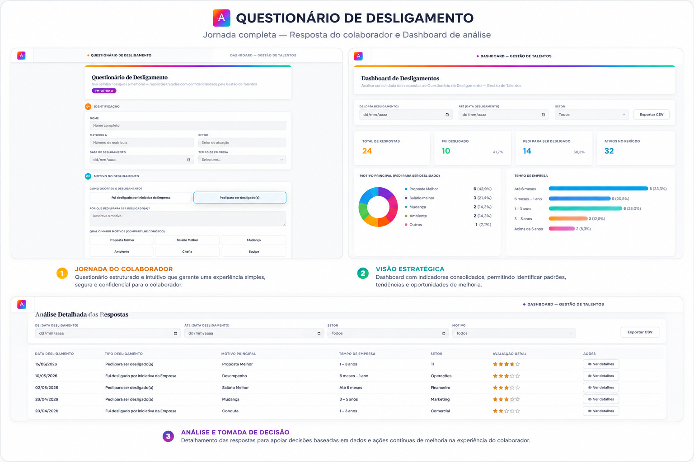
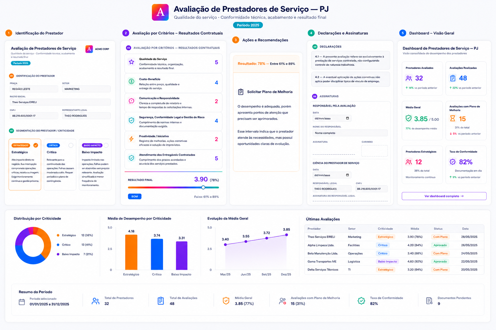
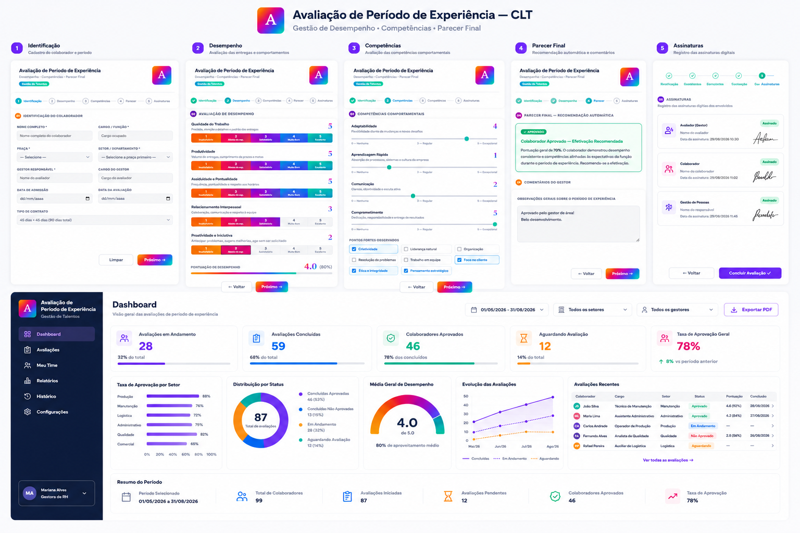

# Manoel Gustavo — Projetos de Recursos Humanos, Processos e People Analytics

> **Estrategista de Recursos Humanos | Agilista | Analista Técnico Comportamental DISC**  
> Gestão de Pessoas · Psicologia Organizacional · Projetos & Processos · People Analytics · Inovação · ESG

Este repositório reúne projetos autorais desenvolvidos para demonstrar como transformo necessidades de **Recursos Humanos** em processos estruturados, experiências digitais, indicadores e ferramentas de gestão.

Meu foco não é apenas desenvolver interfaces: cada projeto parte de um problema de Gestão de Pessoas e busca organizar o fluxo, melhorar a experiência do usuário, ampliar a rastreabilidade das informações e apoiar decisões orientadas por dados.

[**▶ Visualizar Portfólio Profissional**](https://gustavomrtns.github.io/projetos_rh/) · [**LinkedIn**](https://www.linkedin.com/in/manoel-gustavo/)

---

## Competências em evidência

Os projetos articulam quatro dimensões principais da minha atuação profissional:

- **Estratégia de RH:** T&D, onboarding/offboarding, desempenho, comunicação interna e experiência do colaborador.
- **Projetos & Processos:** identificação de necessidades, definição de escopo, priorização de entregas, alinhamento com stakeholders, mapeamento de fluxos, Kanban e melhoria contínua.
- **Dados & Tecnologia:** People Analytics, indicadores, dashboards, automação, HTML/CSS/JavaScript, Power BI, Python, SQL e IA aplicada a RH.
- **Comportamento & Organizações:** análise comportamental DISC, Psicologia Organizacional, cultura, engajamento, DEI e ESG.

### Estrutura dos cases

Cada projeto é apresentado a partir da lógica:

**Visão executiva → Evidência visual → O desafio → Minha atuação → A solução → Como funciona → Valor potencial → Competências demonstradas → Tecnologias e abordagens**

---

## Galeria visual dos cases

  
  

  
  

  
  

  
  

*Clique em uma evidência visual para acessar o case completo no GitHub.*

---

## Projetos em destaque

A ordem abaixo segue a **escala de impacto dos projetos** adotada para o portfólio.

| # | Projeto | Problema / oportunidade | Solução desenvolvida | Competências demonstradas |
|---|---|---|---|---|
| **01** | **[GT360º — Workspace de Gestão de Talentos](./gt360/)** ⭐ | Processos de onboarding e T&D distribuídos em controles distintos | Concepção de workspace digital a partir do mapeamento de dores, definição de fluxos, requisitos funcionais, indicadores e experiência do usuário | Gestão de Pessoas, T&D, processos, indicadores, UX e automação |
| **02** | **[eu + horizonte — Intranet](./eu-horizonte-intranet/)** | Necessidade de centralizar comunicação e experiência interna | Protótipo de intranet para comunicação, informação e jornada do colaborador | Comunicação interna, EX, UX e Employer Branding |
| **03** | **[Pesquisa de Engajamento Organizacional](./pesquisa-engajamento-organizacional/)** | Aplicação, tabulação e análise de pesquisas internas em fluxos dispersos | Plataforma para construção da pesquisa, aplicação, recortes demográficos e dashboard analítico | People Analytics, engajamento, Employee Experience, dados e UX |
| **04** | **[Quadro de Gestão — Kanban RH e Projetos](./quadro-gestao-kanban/)** | Baixa visibilidade sobre demandas, prioridades e responsáveis | Painel Kanban para gestão de demandas, projetos, sprints e checklists | Agilidade, Kanban, priorização e gestão de projetos |
| **05** | **[Checklist 5S](./checklist-5s/)** | Auditorias e controles de conformidade pouco padronizados | Aplicação digital com critérios de avaliação e indicadores | 5S, melhoria contínua, processos e indicadores |
| **06** | **[Questionário de Desligamento](./questionario-desligamento/)** | Feedbacks de saída pouco estruturados e difíceis de comparar | Instrumento digital para coleta e organização de dados de offboarding | Employee Experience, dados e melhoria de processos |
| **07** | **[Avaliação de Prestadores — PJ](./avaliacao-prestador-pj/)** | Necessidade de critérios objetivos para acompanhamento de prestadores | Avaliação digital por critérios contratuais e impacto | Governança, fornecedores, avaliação e processos |
| **08** | **[Avaliação de Experiência — CLT](./avaliacao-experiencia-clt/)** | Acompanhamento do período de experiência sem padronização | Ferramenta estruturada para avaliação e suporte à decisão | Performance, feedback, gestão de pessoas e dados |

---

## Projeto flagship — GT360º

O **GT360º** é o principal projeto deste portfólio. Foi concebido como um workspace digital de Gestão de Talentos, partindo do **mapeamento de dores dos processos de onboarding e T&D** até a definição de **fluxos, requisitos funcionais, indicadores e experiência do usuário**.

Minha atuação no projeto envolveu identificação de necessidades, definição de escopo, organização e priorização de entregas, alinhamento com stakeholders, estruturação dos fluxos e lógica de indicadores, mantendo a tecnologia como meio para resolver problemas reais de Gestão de Pessoas.

### Módulo 1 — Fluxo de Onboarding

Estrutura o acompanhamento da integração do colaborador, organizando etapas, responsabilidades, informações e indicadores relacionados à experiência de entrada.

### Módulo 2 — Painel de Treinamentos

Organiza o ciclo de Educação Corporativa, permitindo acompanhar treinamentos, certificações, materiais, indicadores, impacto e lógica de mensuração de ROI.

**[Abrir GT360º](https://gustavomrtns.github.io/projetos_rh/gt360/)**

---

## Stack e abordagens

**Gestão de Pessoas**  
T&D · Onboarding · Offboarding · Performance · Employee Experience · Comunicação Interna · Employer Branding

**Projetos & Processos**  
Identificação de Necessidades · Definição de Escopo · Priorização de Entregas · Stakeholders · Scrum · Kanban · Sprints · Mapeamento de Processos · Melhoria Contínua · OKRs · Gestão de Demandas

**Dados & Tecnologia**  
People Analytics · Power BI · Python · SQL · HTML · CSS · JavaScript · IA aplicada a RH

**Comportamento & Organizações**  
Análise Comportamental DISC · Psicologia Organizacional · Cultura · Engajamento · DEI · ESG

---

## Navegação rápida

- [Portfólio Profissional — GitHub Pages](https://gustavomrtns.github.io/projetos_rh/)
- [GT360º](https://gustavomrtns.github.io/projetos_rh/gt360/)
- [eu + horizonte — Intranet](https://gustavomrtns.github.io/projetos_rh/eu-horizonte-intranet/)
- [Pesquisa de Engajamento Organizacional](https://gustavomrtns.github.io/projetos_rh/pesquisa-engajamento-organizacional/)
- [Quadro de Gestão](https://gustavomrtns.github.io/projetos_rh/quadro-gestao-kanban/)
- [Checklist 5S](https://gustavomrtns.github.io/projetos_rh/checklist-5s/)
- [Questionário de Desligamento](https://gustavomrtns.github.io/projetos_rh/questionario-desligamento/)
- [Avaliação de Prestadores — PJ](https://gustavomrtns.github.io/projetos_rh/avaliacao-prestador-pj/)
- [Avaliação de Experiência — CLT](https://gustavomrtns.github.io/projetos_rh/avaliacao-experiencia-clt/)

---

## Sobre mim

Sou profissional de Recursos Humanos com atuação multidisciplinar em Gestão de Pessoas, projetos, processos, dados e tecnologia. Busco fazer interseccionalidade em **Gestão de Pessoas nas Organizações e Ciberpsicologia**, abordando pilares de **Gestão de Processos, Psicologia Organizacional, Inovação e ESG**.

**Contato profissional:** [LinkedIn](https://www.linkedin.com/in/manoel-gustavo/) · [Portfólio](https://gustavomrtns.github.io/projetos_rh/)