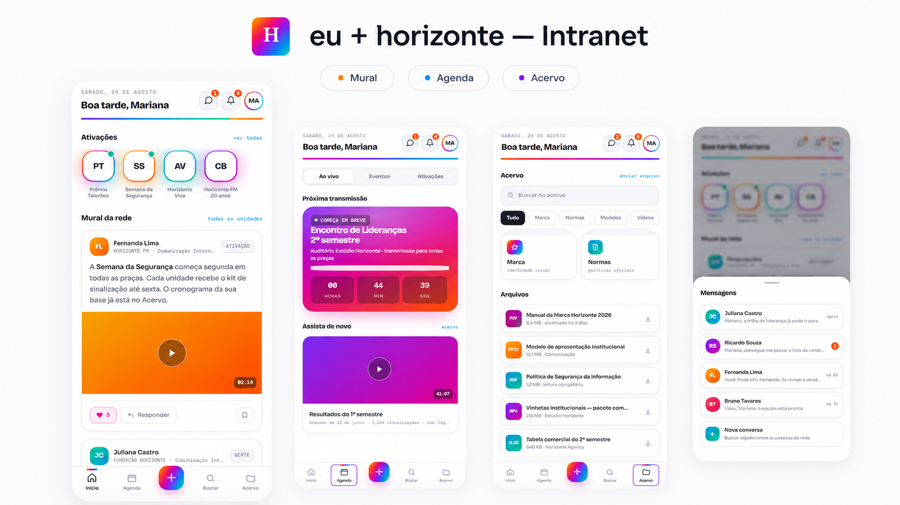

# eu + horizonte — Intranet & Employee Experience

> Protótipo de ambiente digital de comunicação interna concebido para aproximar pessoas, conteúdos e cultura em uma experiência única, acessível e orientada à jornada do colaborador.

[▶ Explorar aplicação](https://gustavomrtns.github.io/projetos_rh/eu-horizonte-intranet/) · [🌐 Portfólio Profissional](https://gustavomrtns.github.io/projetos_rh/) · [← Todos os projetos](../README.md)

---

## Visão executiva

| Dimensão | eu + horizonte |
|---|---|
| **Área** | Recursos Humanos / Gestão de Pessoas |
| **Frentes** | Comunicação Interna · Employee Experience · Cultura · Employer Branding |
| **Objetivo** | Centralizar conteúdos e pontos de contato da jornada interna em uma experiência digital mais simples e integrada |
| **Minha atuação** | Arquitetura de informação, organização de conteúdos, desenho de jornadas, UX e desenvolvimento do protótipo digital |
| **Abordagens** | Comunicação Interna · Employee Experience · UX · Gestão de Conteúdo |
| **Tecnologias** | HTML · CSS · JavaScript |

---

## Evidência visual

A composição apresenta quatro pontos centrais da experiência: **mural e ativações**, **agenda e transmissões**, **acervo de conteúdos e documentos** e **fluxo de criação/publicação**. Em conjunto, as telas demonstram como a solução conecta comunicação, conteúdo, engajamento e autonomia em uma única experiência digital.

---

## O desafio

Quando informações institucionais, comunicados e conteúdos relevantes ficam distribuídos em diferentes canais, o colaborador precisa despender mais esforço para encontrar o que necessita. Esse cenário também pode reduzir a consistência da comunicação e enfraquecer a experiência digital ao longo da jornada interna.

O projeto parte desse problema para explorar uma questão central: **como transformar a comunicação interna em uma experiência digital mais integrada, intuitiva e próxima das pessoas?**

## Meu papel no projeto

Minha atuação envolveu a estruturação do conceito e da experiência do produto, conectando necessidades de Gestão de Pessoas com princípios de organização da informação e design de interação.

- Estruturação da arquitetura de informação.
- Organização de conteúdos e jornadas de navegação.
- Definição da experiência e dos pontos de contato dentro da aplicação.
- Desenvolvimento do protótipo funcional da intranet.
- Aplicação de princípios de Employee Experience e Comunicação Interna.
- Construção da interface em HTML, CSS e JavaScript.

## A solução

O **eu + horizonte** foi concebido como um ambiente digital de comunicação interna que concentra informações, conteúdos e interações relacionadas à experiência do colaborador.

A aplicação adota uma linguagem inspirada em produtos digitais contemporâneos, com navegação orientada a telas, hierarquia visual clara, componentes interativos e uma experiência responsiva. O objetivo não é apenas disponibilizar informação, mas tornar o acesso a ela mais simples, organizado e conectado à cultura interna.

## Experiência e arquitetura

A solução trabalha quatro dimensões complementares:

**Comunicação** — organização de conteúdos e informações internas em um ambiente central.

**Experiência** — navegação desenhada para reduzir atrito e facilitar o acesso aos pontos de contato da jornada.

**Cultura** — espaço digital capaz de apoiar a circulação de mensagens, referências e conteúdos institucionais.

**Engajamento** — recursos de interface e interação que aproximam a experiência de uma aplicação de uso cotidiano, em vez de um repositório estático de informações.

## Decisões de produto e UX

O protótipo foi estruturado com abordagem **mobile-first**, utilizando uma interface de aplicativo e componentes próprios de interação. A solução incorpora transições entre telas, hierarquia de conteúdos, feedback visual, navegação por componentes e elementos de microinteração.

A implementação também considera comportamento responsivo e diferentes dimensões de viewport, permitindo que a experiência se adapte ao dispositivo utilizado.

## Valor para Gestão de Pessoas

A proposta contribui para transformar a intranet em um ponto de contato da experiência do colaborador, conectando Comunicação Interna, Employee Experience e Employer Branding.

Em termos de gestão, a solução foi concebida para favorecer:

- centralização da comunicação e dos conteúdos internos;
- acesso mais simples a informações relevantes;
- maior consistência na experiência digital do colaborador;
- fortalecimento dos pontos de contato entre pessoas e organização;
- apoio à disseminação de cultura e comunicação institucional;
- construção de uma experiência interna mais próxima de produtos digitais contemporâneos.

## Competências demonstradas

`Comunicação Interna` · `Employee Experience` · `Employer Branding` · `UX` · `Arquitetura de Informação` · `Gestão de Conteúdo` · `Design de Interação` · `HTML` · `CSS` · `JavaScript`

---

### Navegação

[▶ Abrir eu + horizonte](https://gustavomrtns.github.io/projetos_rh/eu-horizonte-intranet/) · [🌐 Ver Portfólio Profissional](https://gustavomrtns.github.io/projetos_rh/) · [← Voltar aos projetos](../README.md)
