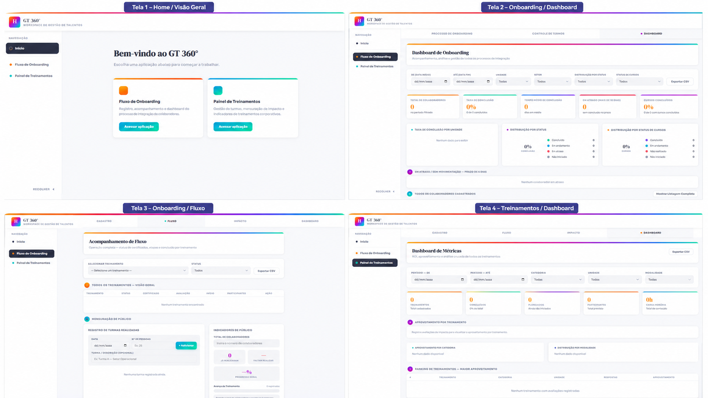

# GT360º — Workspace de Gestão de Talentos

> **Projeto flagship do portfólio de Manoel Gustavo.** Uma solução digital de RH concebida para integrar processos, dados e indicadores de **Onboarding** e **Treinamento & Desenvolvimento** em um único ambiente de gestão.

[▶ **Explorar aplicação**](https://gustavomrtns.github.io/projetos_rh/gt360/) · [🌐 **Portfólio Profissional**](https://gustavomrtns.github.io/projetos_rh/) · [← **Todos os projetos**](../README.md)

---

## Visão executiva

| Dimensão | GT360º |
|---|---|
| **Área** | Recursos Humanos / Gestão de Pessoas |
| **Frentes integradas** | Onboarding + Treinamento & Desenvolvimento |
| **Objetivo** | Centralizar fluxos, informações e indicadores para ampliar rastreabilidade, padronização e visão gerencial |
| **Minha atuação** | Mapeamento de processos, levantamento de requisitos, arquitetura da solução, UX de processos, lógica de indicadores e desenvolvimento do protótipo digital |
| **Abordagens** | Gestão de Projetos · People Analytics · T&D · Onboarding · Automação · UX |
| **Tecnologias** | HTML · CSS · JavaScript |

## Evidência visual



*Visão do GT360º como workspace de Gestão de Talentos. A interface evidencia a integração entre processos de Onboarding, Treinamento & Desenvolvimento e acompanhamento gerencial em um mesmo ambiente digital.*

> **O que observar:** a solução foi desenhada a partir do fluxo de RH. Navegação, módulos, controles e indicadores estão organizados para transformar rotinas operacionais em uma experiência de gestão estruturada.

## O desafio

Rotinas de Onboarding e Treinamento & Desenvolvimento podem operar em controles separados, planilhas e fluxos manuais. Esse cenário fragmenta informações e dificulta a visualização de etapas, responsabilidades, capacitações, certificações e indicadores em uma perspectiva integrada.

O GT360º foi estruturado a partir desse problema: **como transformar processos de RH distribuídos em uma experiência de gestão mais centralizada, rastreável e orientada por dados?**

## Meu papel no projeto

Minha atuação no GT360º envolve a conexão entre **Gestão de Pessoas, processos, dados e tecnologia**. O projeto não parte da tecnologia como fim; a tecnologia é utilizada como meio para estruturar uma necessidade de RH.

- Mapeamento dos fluxos de Onboarding e Educação Corporativa.
- Identificação de etapas, responsabilidades, informações e pontos de melhoria.
- Levantamento e organização de requisitos funcionais.
- Estruturação da arquitetura de navegação e dos módulos do workspace.
- Definição da lógica de acompanhamento e indicadores.
- Desenvolvimento do protótipo digital e da experiência de uso.
- Integração conceitual entre dados operacionais e visão gerencial.

## Arquitetura da solução

```text
                    GT360º
                       │
          ┌────────────┴────────────┐
          │                         │
     ONBOARDING                   T&D
          │                         │
  Etapas e responsáveis      Treinamentos e turmas
  Jornada de integração      Certificações e materiais
  Acompanhamento             Aproveitamento e impacto
          │                         │
          └────────────┬────────────┘
                       │
              DADOS E INDICADORES
                       │
                       ▼
              VISÃO GERENCIAL DE RH
```

A proposta é conectar a execução dos processos à capacidade de acompanhamento, criando uma base mais organizada para análise e tomada de decisão.

## Módulo 1 — Fluxo de Onboarding

Estrutura o acompanhamento da integração do colaborador desde o registro até a conclusão das etapas previstas no processo.

**O módulo foi pensado para:**

- organizar etapas e responsabilidades;
- centralizar informações da jornada de integração;
- acompanhar o andamento do processo;
- reduzir dependência de controles dispersos;
- criar uma base para indicadores de onboarding.

## Módulo 2 — Painel de Treinamentos

Estrutura o ciclo de Educação Corporativa e permite organizar informações relacionadas às ações de capacitação.

**O módulo contempla a lógica de:**

- cadastro de treinamentos planejados e em andamento;
- acompanhamento de turmas e conclusão;
- controle de certificados;
- repositório de materiais;
- acompanhamento de aproveitamento e impacto;
- indicadores de T&D;
- estrutura para análise de ROI de treinamento.

## Valor gerado pela solução

O projeto foi concebido para gerar valor principalmente por meio da **estruturação e integração dos processos**. Entre os benefícios funcionais demonstráveis no protótipo estão:

- **Centralização:** informações de Onboarding e T&D organizadas em um mesmo ambiente.
- **Rastreabilidade:** maior clareza sobre etapas, status e responsabilidades.
- **Padronização:** transformação de rotinas dispersas em fluxos estruturados.
- **Visibilidade:** consolidação de informações para acompanhamento gerencial.
- **Mensuração:** organização da base necessária para indicadores de RH e análises de impacto.
- **Escalabilidade:** estrutura concebida para evoluir com novos módulos, integrações e automações.

> **Nota sobre resultados:** este case apresenta a solução, sua arquitetura e seus benefícios funcionais. Não são atribuídos percentuais de ganho, economia ou ROI sem mensuração comprovada.

## Competências profissionais demonstradas

| Eixo | Evidências no projeto |
|---|---|
| **Gestão de Pessoas** | Onboarding, T&D e experiência do colaborador |
| **Projetos & Processos** | Mapeamento de fluxos, requisitos, estruturação e melhoria de processos |
| **People Analytics** | Organização de dados, indicadores e visão gerencial |
| **Tecnologia aplicada a RH** | Desenvolvimento de solução digital orientada a uma necessidade de Gestão de Pessoas |
| **UX de processos** | Organização da navegação e experiência de uso a partir do fluxo operacional |
| **Inovação** | Integração de processos tradicionalmente separados em um workspace único |

## Stack e abordagens

`HTML` · `CSS` · `JavaScript` · `Gestão de Projetos` · `Mapeamento de Processos` · `People Analytics` · `T&D` · `Onboarding` · `UX` · `Automação`

---

### Quer explorar o projeto?

[▶ **Abrir GT360º**](https://gustavomrtns.github.io/projetos_rh/gt360/)

O GT360º faz parte de um portfólio de soluções aplicadas a Recursos Humanos, Gestão de Pessoas, processos e dados.

[**Conhecer o Portfólio Profissional**](https://gustavomrtns.github.io/projetos_rh/) · [**Ver todos os projetos no GitHub**](../README.md)
